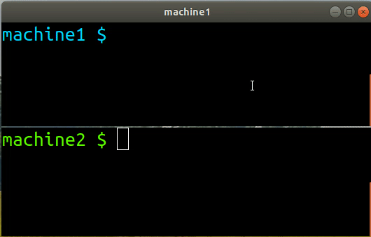
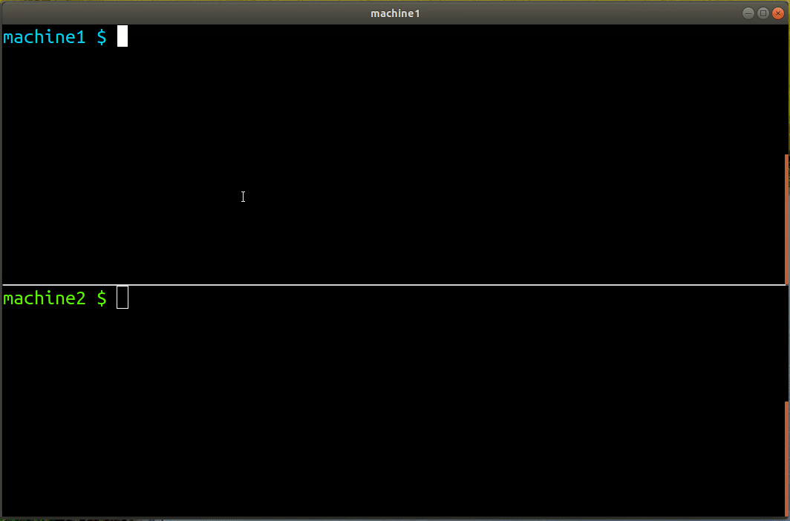

# pcopy
[](https://github.com/binwiederhier/pcopy/releases/latest)
[](https://pkg.go.dev/heckel.io/pcopy)
[](https://github.com/binwiederhier/pcopy/actions)
[](https://goreportcard.com/report/github.com/binwiederhier/pcopy)
[](https://codecov.io/gh/binwiederhier/pcopy)
[](https://gophers.slack.com/archives/C01JMTPGF2Q)

pcopy is an across-the-network clipboard that allows copying (`pcp < file.txt`) and pasting (`ppaste > file.txt`)
across different computers. Other users can be invited to join (`pcopy invite`), or simply join by specifying 
the hostname (`pcopy join`). 

**Features:**
* 📋 Copy/paste across computers (via STDIN/STDOUT)
* 🔒 HTTPS-only secure server (via cert-pinning)
* 🔑 Clipboards can be password-protected, or they can be open for everyone
* 📚 Support for multiple clipboards (e.g. personal, work, ...)
* 🌎 Simple [Web UI](#web-ui-for-uploading-text-snippets-or-large-files) for uploading text snippets or large files
* 🔗 Direct temporary links to clipboard content (with TTL/expiration) 
* 💻 No-install `curl`-compatible clipboard usage

To see what else pcopy can do, check out the **[live demo](#demo)** or the **[videos](#videos)**.



## Installation
Binaries can be found on the [releases page](https://github.com/binwiederhier/pcopy/releases). 

**Debian/Ubuntu** (*from a repository*)**:**   
```bash
curl -sSL https://archive.heckel.io/apt/pubkey.txt | sudo apt-key add -
sudo apt install apt-transport-https
sudo sh -c "echo 'deb [arch=amd64] https://archive.heckel.io/apt debian main' > /etc/apt/sources.list.d/archive.heckel.io.list"  
sudo apt update
sudo apt install pcopy
```

**Debian/Ubuntu** (*manual install*)**:**
```bash
wget https://github.com/binwiederhier/pcopy/releases/download/v0.4.5/pcopy_0.4.5_amd64.deb
dpkg -i pcopy_0.4.5_amd64.deb
```

**Fedora/RHEL/CentOS:**
```bash
rpm -ivh https://github.com/binwiederhier/pcopy/releases/download/v0.4.5/pcopy_0.4.5_amd64.rpm
```

**Docker** (*see [detailed instructions](#docker-usage)*)**:**
```bash
docker run --rm -it binwiederhier/pcopy
```

**Go** (*requires Go 1.16beta1*)**:**
```bash
go get golang.org/dl/go1.16beta1
go1.16beta1 download
go1.16beta1 get heckel.io/pcopy/cmd/pcopy
```

**Manual install** (*any x86_64-based Linux*)**:**
```bash
wget https://github.com/binwiederhier/pcopy/releases/download/v0.4.5/pcopy_0.4.5_linux_x86_64.tar.gz
sudo tar -C /usr/bin -zxf pcopy_0.4.5_linux_x86_64.tar.gz pcopy
```

After installation, you may want to check out the [Bash/ZSH autocomplete instructions](#bashzsh-autocompletion).

## Usage

### Set up a pcopy server
To setup a new pcopy server, simply run `sudo pcopy setup` (see [server setup demo](#videos)): 
```bash
sudo pcopy setup
sudo systemctl enable pcopy
sudo systemctl start pcopy
```
This will walk you through an interactive setup wizard and place a config file at `/etc/pcopy/server.conf` (see 
[sample config](configs/pcopy.conf)). The wizard will set up a pcopy user and a systemd service. Once the service 
is started, it listens on port 2586 by default.

If you've enabled the Web UI, you can browse to it an paste text snippets or upload files to it (see [live demo](#demo)).    

### Join an existing clipboard
To join an existing clipboard, you may use `pcopy join`:
```bash
pcopy join private.example.com
pcopy join work.mycorp.com work
pcopy list
```
You can join multiple clipboards and give each of them an optional alias (see `work` clipboard above). Each 
clipboard has its own config file, either in `~/.config/pcopy` or in `/etc/pcopy` (for root). You can list connected
clipboards with `pcopy list`.

### Start copying & pasting
Now you can start copying and pasting by using `pcp` (short for: `pcopy copy`) and `ppaste` (short for: `pcopy paste`). 
Any connected client, regardless of what computer it's on, can copy/paste like this (see [copy/pasting videos](#videos)):

```bash
pcp < foo.txt            # Copies foo.txt to the default clipboard
pcp bar < bar.txt        # Copies bar.txt to the default clipboard as 'bar'
echo hi | pcp work:      # Copies 'hi' to the 'work' clipboard
echo ho | pcp work:bla   # Copies 'ho' to the 'work' clipboard as 'bla'
pcp : img1/ img2/        # Creates ZIP from two folders, copies it to the clipboard

ppaste                   # Reads from the default clipboard and prints its contents
ppaste bar > bar.txt     # Reads 'bar' from the default clipboard to file 'bar.txt'
ppaste work:             # Reads from the 'work' clipboard and prints its contents
ppaste work:ho > ho.txt  # Reads 'ho' from the 'work' clipboard to file 'ho.txt'
ppaste : images/         # Extracts ZIP from default clipboard to folder images/
```

## Advanced features
The server can be configured via the well-documented config file `/etc/pcopy/server.conf` (see [sample config](configs/pcopy.conf)).
Here are a few highlights:

### Password-protected clipboard 
When you set up a new clipboard via `pcopy setup`, you can enter a password. That derives a key, which is stored in the 
config file (see [Key section](https://github.com/binwiederhier/pcopy/blob/4dfeb5b8647c04cc54aa1538b8fb3f5d384c3700/configs/pcopy.conf#L23-L30)).
To add a password after initial setup, use the `pcopy keygen` command.

When joining a clipboard with `pcopy join`, you'll be asked for a password. When using `curl`, you can provide the 
password via `-u :<password>` (see [curl usage](#curl-compatible-usage)). 

### Support for multiple clipboards
You can provide an (optional) alias to a clipboard when you `pcopy join` it (see [join](#join-an-existing-clipboard)).
You may then later reference that alias in `pcp <alias>:..` and `ppaste <alias>:..` (see [copy/paste](#start-copying--pasting)).

To list all your connected clipboards, simple type:
```bash
$ pcopy list
Clipboard Server address Config file
--------- -------------- ---------------------------
work      10.0.160.67    ~/.config/pcopy/work.conf
default   heckel.io      ~/.config/pcopy/default.conf
```
### Web UI for uploading text snippets or large files
pcopy comes with an optional Web UI. You can check out the [demo](#demo).   
*(Note: The Web UI is very basic, not mobile friendly and a work in progress. Please help!)*



### `curl`-compatible usage 
If you don't want to install `pcopy` on a server, you can use simple HTTP GET/PUT/POSTs, e.g. via `curl`. Use `-u :<password>`
to provide the clipboard password (if any). Here's an example for the [demo clipboard](#demo):
```bash
# Copy/upload to clipboard (POST/PUT both work)
curl -u:demo -d Howdy https://heckel.io:2586/hi-there
curl -u:demo -T germany.jpg https://heckel.io:2586/germany

# Paste/download from clipboard
curl -u:demo https://heckel.io:2586/hi-there
```

### Streaming contents (without storing them on server)
If you have particularly large files to send across, and you know you only want to send them to exactly one server,
you can use ` pcp --stream`. It creates a FIFO device (`mkfifo`) on the server side, and will wait until a reading
client (`ppaste` or `curl ..`) is connected before sending.

```bash
# On machine 1
yes | pcp --stream    # Will block until 'machine 2' is connected

# On machine 2
ppaste | pv > /dev/null
``` 

### Direct temporary links to clipboard content (with TTL/expiration)
You can generate temporary links to clipboard entries with `pcopy link`. You can send this link to someone and they
can download the clipboard content without downloading the client or using any command line tools:

```bash
$ pcopy link --ttl 1h hi-there
# Temporary download link for file 'default' in clipboard 'default'
https://heckel.io:2586/hi-there?a=SE1BQyAxNjA5MTg0MjY1IDM2MDA...
```

### Limiting clipboard usage
You can limit the clipboard usage in various ways in the config file (see [config file](https://github.com/binwiederhier/pcopy/blob/4dfeb5b8647c04cc54aa1538b8fb3f5d384c3700/configs/pcopy.conf#L66-L101)), 
to avoid abuse:

* `ClipboardSizeLimit`: Limits the total size of the entire clipboard (size of all files)
* `ClipboardCountLimit`: Limits the number of clipboard files
* `FileSizeLimit`: Limits the per-file size
* `FileExpireAfter`: Limits the age of a file (after which they will be deleted)

The [demo clipboard](#demo) uses these settings very restrictively to avoid abuse.

### Docker usage
To use the [pcopy image](https://hub.docker.com/r/binwiederhier/pcopy), simply pull it and set up a few 
shell aliases to simplify local usage: 

```bash
docker pull binwiederhier/pcopy
alias pcopy="docker run --rm -v ~/.cache/pcopy:/var/cache/pcopy -v ~/.config/pcopy:/etc/pcopy -p 2586:2586/tcp -it binwiederhier/pcopy"
alias pcp="pcopy copy"
alias ppaste="pcopy paste"
```

This maps the following folders and ports (you may choose different host folders):
* Config folder: `/etc/pcopy` (image) to `~/.config/pcopy` (host)
* Clipboard folder (only for server usage): `/var/cache/pcopy` (image) to `~/.cache/pcopy` (host)
* Service port (only for server usage): 2586 (both image and host) 

You can then use pcopy just like it was installed on your host system. To use it as a client, run 
`pcopy join` (see [join instructions](#join-an-existing-clipboard)). To set up a server, run

```bash
pcopy setup
pcopy serve
```

### Bash/ZSH autocompletion
Tab completion is available for Bash and ZSH. For Bash, when installed via rpm/deb, autocomplete is immediately
available. ZSH autocomplete installation is manual.

**Bash** (*only if not installed via rpm/deb*):
```
sudo wget -O /etc/bash_completion.d/pcopy https://raw.githubusercontent.com/binwiederhier/pcopy/master/scripts/autocomplete_bash
sudo ln -s /etc/bash_completion.d/pcopy /etc/bash_completion.d/pcp
sudo ln -s /etc/bash_completion.d/pcopy /etc/bash_completion.d/ppaste
```

**ZSH**:
```
mkdir -p ~/.config/pcopy
wget -O ~/.config/pcopy/autocomplete_zsh https://raw.githubusercontent.com/binwiederhier/pcopy/master/scripts/autocomplete_zsh
for p in pcopy pcp ppaste; do echo "PROG=$p source ~/.config/pcopy/autocomplete_zsh" >> ~/.zshrc; done
```

## Demo
I have a **demo clipboard** (password: *demo*) running that you can play with:

- To join via the command line: `pcopy join heckel.io` (see [join instructions](#join-an-existing-clipboard))
- Or use the [web UI](https://heckel.io:2586) (this is *work in progress*, I'm not a web designer, please help!)
- Or simply use `curl` (see [curl usage](#curl-compatible-usage)) 

*(The demo clipboard is limited to 100 MB total, 1 MB per file, 100 files. Clipboard contents time out after 5 minutes.)*

I also made a couple [more videos](#videos) to show what else pcopy can do.

## Videos

<table>
  <tr>
    <td></td>
    <td></td>
    <td></td>
  </tr>
  <tr>
    <td>Simple copy & paste</td>
    <td>Setting up a new server</td>
    <td>Copying entire folders</td>
  </tr>
  <tr>
    <td></td>    
    <td></td>
    <td></td>
    <td></td>
  </tr>
  <tr>
    <td>Creating a link to a password-protected clipboard</td>        
    <td>Copying/uploading through the Web UI</td>
    <td>Copy/pasting with `curl`</td>
    <td></td>
  </tr>
</table>

## Command-line help
Each command has a detailed help page. Simply type `pcopy -help`, `pcp -help`, etc. Here's the main help page:
```bash 
$ pcopy --help
NAME:
   pcopy - copy/paste across machines

USAGE:
   pcopy COMMAND [OPTION..] [ARG..]

COMMANDS:
   Client-side commands:
     copy, c    Read from STDIN/file(s) and copy to remote clipboard
     paste, p   Write remote clipboard contents to STDOUT/file(s)
     join, add  Join a remote clipboard
     leave, rm  Leave a remote clipboard
     list, l    Lists all of the clipboards that have been joined
     link, n    Generate direct download link to clipboard content
     invite, i  Generate commands to invite others to join a clipboard
   Server-side commands:
     serve   Start pcopy server
     setup   Initial setup wizard for a new pcopy server
     keygen  Generate key for the server config

Try 'pcopy COMMAND --help' for more information.
``` 

## Inspired by
Thanks [nakabonne](https://github.com/nakabonne) for making [pbgopy](https://github.com/nakabonne/pbgopy), and for 
[posting it on Reddit](https://www.reddit.com/r/golang/comments/k2nzyn/pbgopy_copy_and_paste_between_devices/gdwpy8u/?context=3). 
It inspired me to make pcopy. 

The Web UI is inspired by [nopaste.ml](https://nopaste.ml/).

As many may instantly notice, pcopy is similar to [pbcopy/pbpaste](https://osxdaily.com/2007/03/05/manipulating-the-clipboard-from-the-command-line/). 
However, pcopy can copy/paste across the network. You can copy on your laptop and paste on your servers.

pcopy may also replace [scp](https://linux.die.net/man/1/scp) or [rsync](https://linux.die.net/man/1/rsync) in simple cases,
when you just want to copy a file or folder across to another computer. 

## License
Made with ❤️ by [Philipp C. Heckel](https://heckel.io), distributed under the [Apache License 2.0](LICENSE).

Third party libraries:
* [github.com/urfave/cli/v2](https://github.com/urfave/cli/v2) (MIT) is used to drive the CLI
* [CryptoJS](https://github.com/brix/crypto-js) (MIT) is used for key derivation and such in the Web UI
* [Lato Font](https://www.latofonts.com/) (OFL) is used as a font in the Web UI
* [GoReleaser](https://goreleaser.com/) (MIT) is used to create releases 

Code and posts that helped:
* [Drag & Drop](https://stackoverflow.com/a/33917000/1440785) (CC BY-SA 3.0)
* [Progress indicator](https://github.com/machinebox/progress) (Apache 2.0)
* [Rate limiting](https://www.alexedwards.net/blog/how-to-rate-limit-http-requests) (MIT)
* [Find common directory](https://rosettacode.org/wiki/Find_common_directory_path#Go) (GFDLv1.2)
* [Full page centering](https://medium.com/creative-technology-concepts-code/full-page-site-with-vertical-centering-using-css-only-7858ed6764c4)
* [Human readable file sizes](https://yourbasic.org/golang/formatting-byte-size-to-human-readable-format/)
* [Unzipping files](https://golangcode.com/unzip-files-in-go/)
* [HTTP server routing](https://benhoyt.com/writings/go-routing/#regex-table)
* [HTTP server error handling](https://thingsthatkeepmeupatnight.dev/posts/golang-http-handler-errors/)
* [Google Webfonts Helper](https://google-webfonts-helper.herokuapp.com/)
